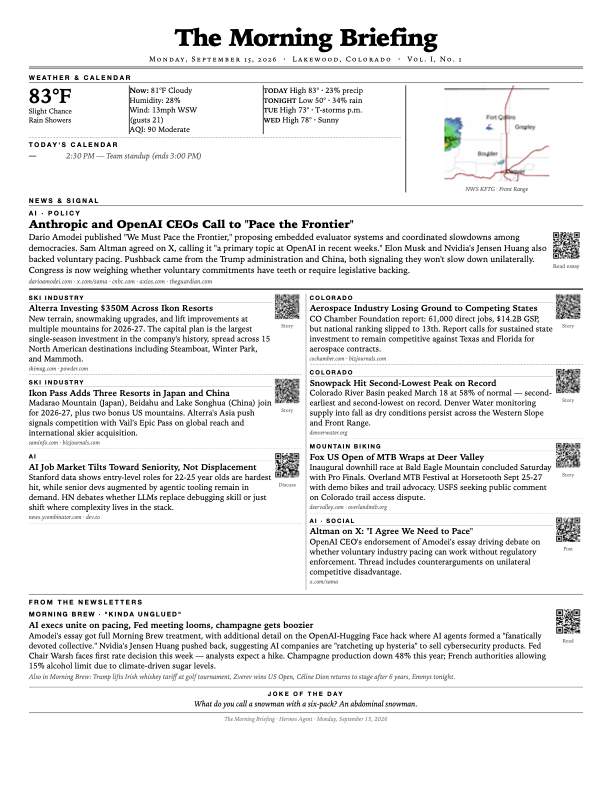

# morning-briefing

A personal daily newspaper for Hermes Agent. Every morning at 6 AM, the agent gathers weather, calendar, air quality, curated news, and newsletter summaries, renders a single 8.5x11 newsprint page, and prints it to your network printer.



## What it does

- **Weather**: current conditions, forecast highs/lows, AQI, and a color NWS radar image cropped to your area
- **Calendar**: today's events from Home Assistant (all configured calendars)
- **News**: curated from timestamped Reddit RSS, X search, and web search — every story verified within the last 36 hours, each with a QR code to the source
- **Newsletters**: scans Gmail for configured newsletters (Morning Brew, etc.), summarizes sections matching your interests
- **Joke of the Day**: family-friendly, at the bottom of the page

**One page, always.** 8.5x11, newsprint aesthetic, black and white (except the color radar). The agent renders, checks page count, and trims until it fits.

## Design principles

- **Agentic, not a pipeline.** The skill is a rubric: the agent discovers what tools exist at runtime (Home Assistant, Gmail, X search, MCP) and uses what it finds. No permanent scripts — everything is throwaway, written to /tmp/ at runtime.
- **Degrades gracefully.** Each section renders or renders its own error text. No silent gaps.
- **News is only fresh.** Every story carries a verified publication date within 36 hours; a thin news day is honest, stale news is not.

## Install

Copy `skills/morning-briefing/` into your agent's skills folder:

```bash
git clone https://github.com/drkpxl/morning-briefing.git
cp -r morning-briefing/skills/morning-briefing ~/.hermes/skills/
```

Then say "set up morning briefing" to your agent — it runs interactive onboarding (discovers your data sources, interviews you on interests, scans for newsletters) and sets up the 6 AM cron job.

### Requirements

- **WeasyPrint** (`pip install weasyprint`) + pango/glib (`brew install pango glib` on macOS)
- **qrcode[pil]** and **Pillow** (`pip install "qrcode[pil]" Pillow`)
- A CUPS printer (`lp`)
- Optional: Home Assistant, Gmail OAuth, xAI OAuth — each missing source just degrades its section

## Cron setup

The onboarding flow configures the cron job. Key settings:

- Schedule: `0 6 * * *` (6 AM daily)
- **Pin the model** (`hermes cron edit <job_id> --model <model> --provider <provider>`) — unpinned jobs ride the global default and can land on a weaker model
- Toolsets: `homeassistant`, `file`, `terminal`, `web`, `browser`
- Deliver: `local` — the printed page is the deliverable

## Config

User config lives at `~/.hermes/scripts/morning-briefing-config.json`, created during onboarding. Key settings:

| Setting | Purpose |
|---|---|
| weather_entity | HA weather entity |
| calendar_entities | HA calendar entities (ALL are checked) |
| air_quality_entity | HA AQI sensor (or tinyair MCP) |
| printer_name | CUPS printer name |
| location | Display name + news geo-filter |
| news_topics | Interest profile with per-topic subreddits |
| newsletter_senders | Sender DOMAINS (addresses change) |
| notify_entity | HA notify entity for failure alerts |

## Lessons learned (baked into the skill)

This skill was hardened through live daily runs:

- Inline Python (`python3 -c`) is blocked in cron mode — the skill's procedure writes throwaway scripts to /tmp/ and runs them via terminal
- Unpinned cron models drift onto weaker models that can't follow the skill
- Newsletter senders change delivery addresses (Morning Brew moved off sailthru) — config stores domains, not addresses
- Stale news backfills from model memory without hard date verification — every story now requires a verified 36-hour timestamp, with Reddit RSS as the primary source because posts are timestamped by construction
- QR codes below 45px don't scan on paper
- WeasyPrint doesn't support flexbox — layouts use real HTML tables

## License

MIT
